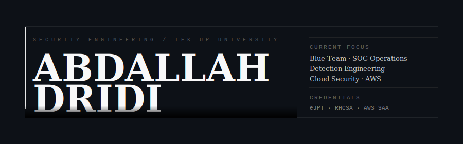
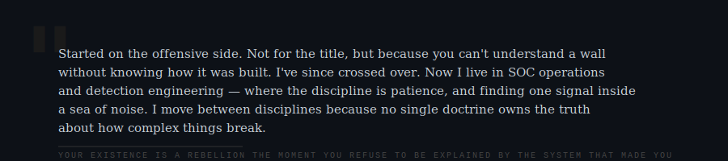
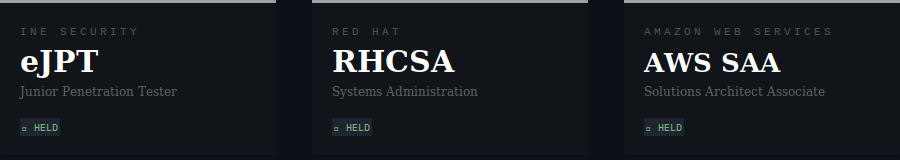
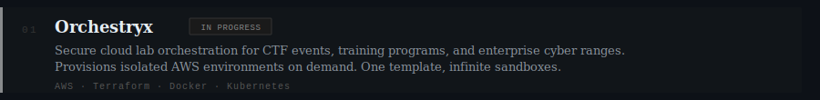
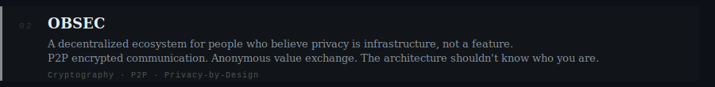
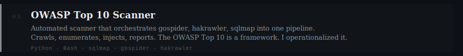
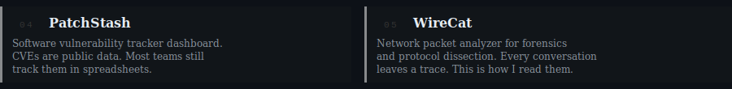

 

 

 

 

**In motion:** `AWS Security Specialty` &nbsp;·&nbsp; `CKA` &nbsp;·&nbsp; `HTB CDSA

 

 

 

**Systems & Platforms**

**Languages**

**Security & Observability**

**Data**

 

 

 

 

 

 

 

&nbsp;&nbsp;

 

